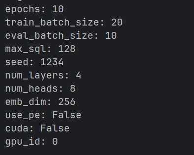
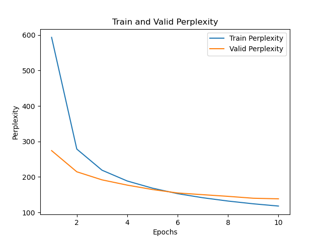
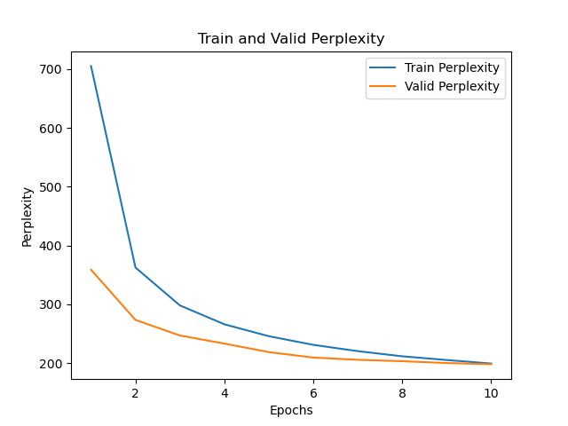
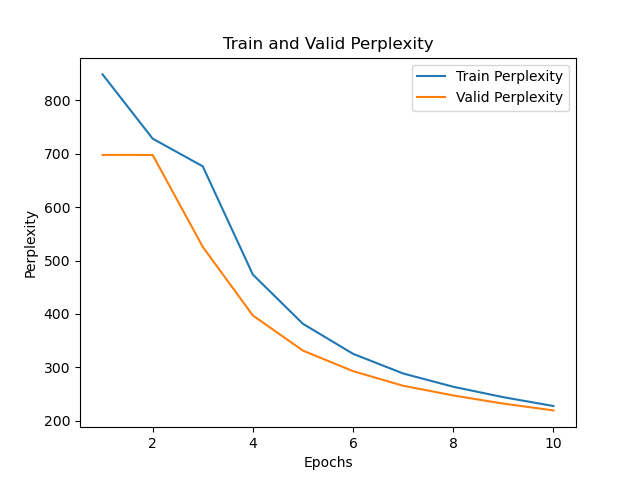

# Train_GPT

## Modify `model.py` and `train.py`
- In `model.py`： Complete the __init__() method for model construction using torch.nn.
- In `train.py`： Modify the model initialization to use three different models: `transformer`, `RNN`, and `LSTM`.

## Result0

    
    
    
    

## TODO
- [ ] Choose one of the three models: `transformer`, `RNN`, or `LSTM` and implement it from scratch.